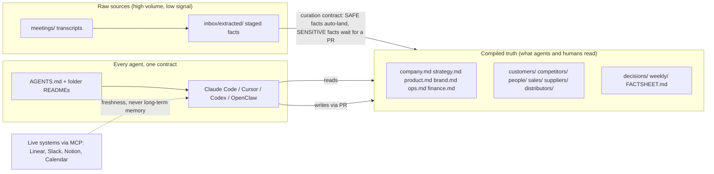

# Company Intelligence - starter template

[](https://github.com/agentmatik/template-intelligence/actions/workflows/validate.yml) [](./LICENSE) [](https://github.com/agentmatik/template-intelligence/generate)

A single-source-of-truth Git repo of plain Markdown that serves three audiences at once:

- **Humans** read it in their editor, GitHub, Obsidian, or a rendered MkDocs site.
- **AI agents** (Claude Code, Cursor, Codex, OpenClaw, Gemini, Windsurf, Aider…) read it via `AGENTS.md`.
- **Live systems** (Linear, Slack, Notion, Granola, Google Workspace) plug in through MCP.

Durable truth lives here. Execution state stays in the systems that own it. Agents synthesize across both.

> 📋 **Need a quick fact or an official link** (app/store URL, socials, company no. / EIN / DUNS, founders, funding), or filling an application/form/deck? See **[`FACTSHEET.md`](./FACTSHEET.md)**, the single dense quick-reference. It ships as a placeholder template; fill it with real values during setup (Step 3 below).

## How it fits together



### What it looks like in use

```text
you:    What did we promise Acme in the last renewal call, and who owns the follow-up?
agent:  From customers/acme-co.md (updated 2026-05-21, last_verified 2026-05-21):
        - Renewal at the current tier until 2027-03; a 20% volume discount was offered
          if they add the EU entity (decisions/2026-05-21-acme-eu-discount.md).
        - Open follow-up: security questionnaire owed by us, owner Sarah, due 2026-06-01
          (meetings/2026-05-21-acme-renewal.md, action items).
        Nothing newer is on record; the next Acme touchpoint is not scheduled yet.
```

Every claim points at a file, every file carries frontmatter (`type`, `status`, `owner`, `updated`, `last_verified`) that CI validates, and nothing lands on `main` without the curation contract in [`docs/CURATION.md`](./docs/CURATION.md).

## What's "intelligence"?

The **intelligence** is the persistent knowledge layer your company runs on: an operating layer, not just storage. Agents and humans both read from it. Both write to it. PRs gate the truth.

## Who this is for

- **Founders** who want their AI agents to actually know their company
- **Small teams (1-20 people)** who don't need enterprise knowledge graphs
- **Consultancies and agencies** who want a reusable client template
- **Anyone** tired of repeating company context to every new chat

## What you get

```
<company>-intelligence/
├── Entry files          AGENTS.md, README.md, INDEX.md
├── Quick reference      FACTSHEET.md (facts + official links, for applications/forms/decks)
├── Root knowledge       company.md, strategy.md, product.md, brand.md, ops.md, finance.md
├── Entity folders       customers/, competitors/, people/, sales/
├── Time-series          meetings/, decisions/, weekly/
├── Agent infrastructure skills/ (optional), templates/
└── Config               .gitignore, .github/workflows/
```

## What to sync into an AI (context vs raw sources)

This repo is **compiled truth + raw sources.** The root knowledge files and entity
folders already distill every meeting and document - so when you sync the repo into
Claude project knowledge (or any AI) for company context, include the **compiled
brain** and skip the **raw sources**, which are redundant *and* the capacity hogs.

> The calls are **not** summarised file-by-file - but their substance is already in
> the compiled pages. **The compiled pages *are* the summary of every call.**

| Tier | Paths | Notes |
|------|-------|-------|
| ✅ **Always sync** (the compiled brain) | **`FACTSHEET.md`**; `company.md` · `strategy.md` · `product.md` · `brand.md` · `ops.md` · `finance.md`; `customers/` · `competitors/` · `people/` · `sales/`; curated `decisions/`; `weekly/`; `INDEX.md` · `README.md` | Small, pure signal: this alone is full company context. The fact sheet is tiny and highest-signal; include it first. |
| 🔶 **Optional** (only if you have headroom) | `decisions/imported/` (if present - granular auto-extracts) · the **last 2-4** strategic `meetings/` (leadership/product/model) | All text/cheap; adds detail but lower-signal than the compiled pages. |
| ❌ **Don't sync** | `meetings/` bulk - **especially standups** · any chart images · `.github/` · `scripts/` · `skills/` · `templates/` | Content already compiled above; images + transcripts are the capacity hogs; the rest is machinery. |

Rule of thumb: **text = high signal per token, images = low.** Even with headroom,
low-value files dilute what the AI retrieves. Full rationale: [`docs/CLAUDE_SYNC.md`](./docs/CLAUDE_SYNC.md).

## Quick start (≤30 minutes)

See [`docs/SETUP.md`](./docs/SETUP.md). It walks you from empty clone to working intelligence with seeded strategy, one skill installed, and Claude Code reading the repo correctly.

## For agents starting fresh

If you're an AI agent reading this repo for the first time - your operating contract is [`AGENTS.md`](./AGENTS.md). Read it before doing anything else.

If you've been asked to **build** an intelligence repo for a company from raw, unstructured data, read these two, in order:

1. [`docs/DATA-ORGANIZATION-PLAYBOOK.md`](./docs/DATA-ORGANIZATION-PLAYBOOK.md) - what goes where and why, plus how to fill the six root files. The routing logic.
2. [`docs/AGENT-INSTRUCTIONS.md`](./docs/AGENT-INSTRUCTIONS.md) - the full nine-phase migration procedure with human checkpoints.

Then each folder's own `README.md` is the complete file-generation contract for that folder (frontmatter, fields, sourcing, worked example, quality bar, edge cases). An agent with no prior context can generate correct, consistent files from those READMEs alone.

## How to use this as a template

1. Click **Use this template** on GitHub (or `gh repo create --template`)
2. Name the new repo `<company>-intelligence`
3. Make it **private**
4. Clone locally, run find/replace on `{{COMPANY_NAME}}`, `{{COMPANY_SHORT}}`, `{{FOUNDER_NAME}}`, etc.
5. Follow [`docs/SETUP.md`](./docs/SETUP.md)

For founders applying this to their own company: budget one afternoon for setup, one week for seed content. For consultancies applying it to a client: budget a 2-hour kickoff workshop plus one week of async ingestion.

## Design principles (the one-paragraph version)

One durable truth (Git) + many live sources (MCP). Prefer file-native context before retrieval systems. Separate stable rules from fluid facts. Keep always-loaded files small. Put repeatable know-how in Skills, not in the root prompt. Use subagents for isolation. Plan, then act, then compact. Use MCP for freshness and narrow writes, not as long-term memory. Assume prompt injection is real. **Don't add RAG, vector DBs, or graph DBs until your traces prove you need them.**

See [`docs/ARCHITECTURE.md`](./docs/ARCHITECTURE.md) for the full rationale.

## License

MIT for the template structure. Your content is yours.

---

**Maintained by [Agentmatik](https://agentmatik.com).** Based on consensus across independent deep research on agent-ready company context patterns (Anthropic, Cline, gbrain, Superpowers, Chroma context-rot research, LangChain context engineering, AGENTS.md standard).
