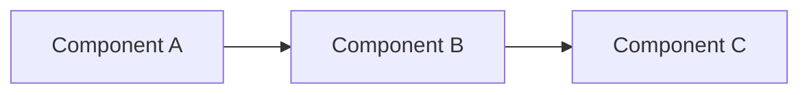

# Product

<!-- What we're building, in one page. Linear owns the live roadmap; this file owns durable product thinking. -->

## What exists today

One paragraph describing what's actually shipped and used.

## Roadmap

Live roadmap lives in **Linear** ([link]). High-level direction below:

- **This quarter:** [theme]
- **Next quarter:** [theme]
- **Beyond:** [theme]

## Architecture

<!-- One paragraph + a Mermaid diagram if helpful. Don't go deep — link to a code repo or design doc instead. -->

## Recent releases

| Date       | Release            | What changed                              |
|------------|--------------------|-------------------------------------------|
| YYYY-MM-DD | v1.0               | Initial launch                            |

## Open questions

- ...

---

- 2026-04-22: Initialized product.md.
