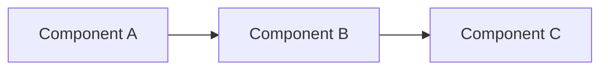

<!-- ============================================================
GENERATION GUIDE (delete this block once filled)

PURPOSE: What's built, what's next, how it's shaped. Durable product thinking.

SOURCE FROM:
  1. PRDs / product specs
  2. The roadmap (Linear, Notion, a deck)
  3. Architecture docs / README of the main code repo
  4. Release notes / changelog

CRITICAL RULE: Linear (or your tracker) owns the LIVE roadmap and backlog.
This file owns DURABLE product thinking only. Do NOT mirror the backlog here  - 
it rots instantly. Link to Linear for live state; capture here the "what exists,
what direction, how it's architected, what we learned" that stays true for weeks.

  - status: draft when generated; human verifies.
  - Architecture: one paragraph + optional Mermaid. Don't paste the whole design doc.
============================================================ -->

# Product

## What exists today

<!-- One paragraph: what's actually shipped and used right now. Source: current
release notes, the live product, README. Not aspirational - what works today. -->

## Roadmap

<!-- DIRECTION only, with a link to the live tracker for detail. Source: roadmap
doc/deck. Three horizons. Don't list individual tickets. -->

Live roadmap lives in **Linear** ([link]). Direction:

- **This quarter:** [theme]
- **Next quarter:** [theme]
- **Beyond:** [theme]

## Architecture

<!-- One paragraph + optional Mermaid diagram. Source: architecture doc, main
repo README, or the CTO. Enough for an agent to reason about the system; link
out for depth. -->

## Recent releases

<!-- A few notable shipped releases with dates. Source: changelog, release notes.
This is light history, not a full changelog (that lives in the repo). -->

| Date       | Release | What changed |
|------------|---------|--------------|
| YYYY-MM-DD | v1.0    | Initial launch |

## Open questions

<!-- Unresolved product questions worth tracking. Source: PRD open-questions
sections, recurring debates in meetings. -->

- ...

---

<!-- APPEND-ONLY TIMELINE. Major launches, architectural shifts, product pivots,
sunset of features. Reverse-chronological. -->

- 2026-04-22: Initialized product.md.
